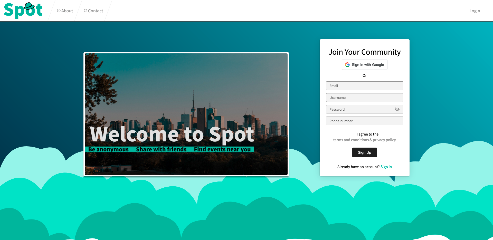

Spot is a social media web application for anonymous location based posts you can share with friends across social media including facebook and google



# Chat service and Lambda function repositories

[spot-chat](https://github.com/krleitch/spot-chat)
- Elixir with phoenix using websockets for realtime authenticated chat

[spot-lambda](https://github.com/krleitch/spot-lambda)
- AWS lambda functions used for image recgonition to detect harmful user content

# Spot-Server
Express Server with Postgresql Db using Prisma

# Spot-Web
Angular13 with NgRx13 store

# Spot-Commons
Common Models, Exceptions, and Constants for both web and server

# Setup

Please view each folders README.md for more information

Clone the repository
```
git clone https://github.com/krleitch/spot.git
```

spot-web
- Add SSL certificates to spot-web (server.crt and server.key)
- Setup environemnt.ts with your googleProviderId and server base url

spot-server
- Add awskey.ts to config folder
```
{
    "AccessKeyID": "",
    "SecretAccessKey": ""
}
```
- Add googlekey.ts to config folder
```
{
    "APIKey": ""
}
```
- Add secret.ts to config folder
```
{
    "secret": ""
}
```
- Update config.ts in config folder with nsfwModelDir and logFileDir

