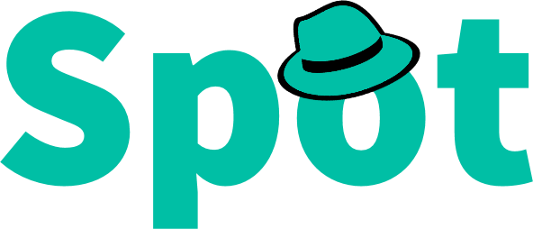

Spot is a social media web application for anonymous location based posts you can share with friends across social media including facebook and google

# Setup

Please view each folders README.md for more information

Clone the repository
```
git clone https://github.com/krleitch/spot.git
```

for spot-web
- Add SSL certificates to spot-web (server.crt and server.key)
- Setup environemnt.ts with your googleProviderId and server base url

for spot-server
- Add awskey.json to config folder
```
{
    "AccessKeyID": "",
    "SecretAccessKey": ""
}
```
- Add googlekey.json to config folder
```
{
    "APIKey": ""
}
```
- Add secret.json to config folder
```
{
    "secret": ""
}
```
- Update config.ts in config folder with nsfwModelDir and logFileDir

## Spot-Server
Express Server with MySql Db

## Spot-Web
Angular9 with NgRx store
## Spot-Commons
Common Types, Errors, and Constants for both web and server